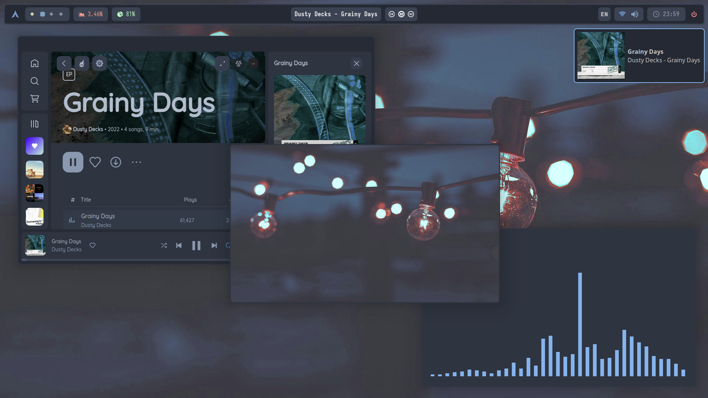
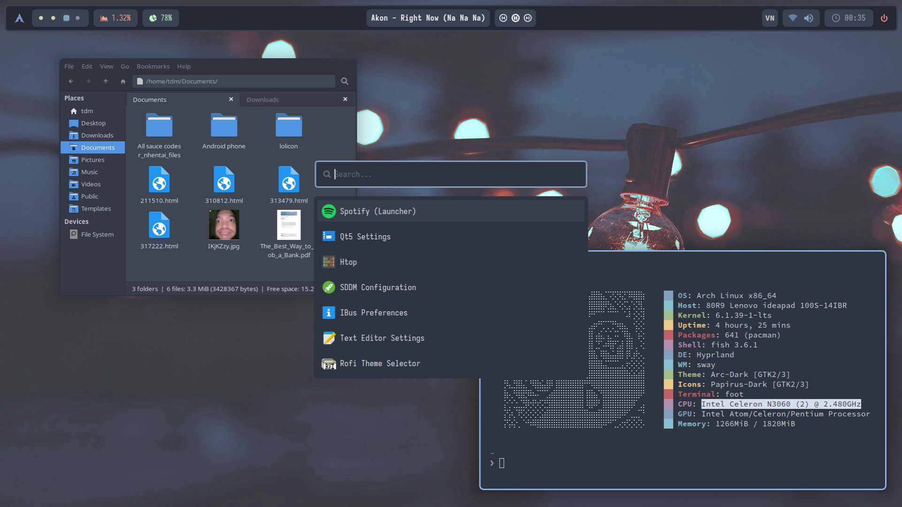
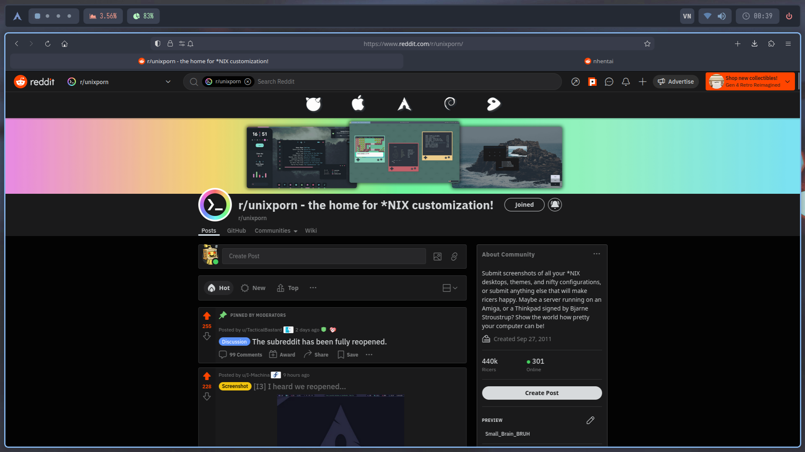

# My Hyprland dotfiles!

## Some previews









## Stuffs used

 - WM:[Hyprland](https://github.com/hyprwm/Hyprland)
 - Bar:[Waybar](https://github.com/Alexays/Waybar)
 - Terminal:[Foot](https://codeberg.org/dnkl/foot)
 - Launcher+powermenu:[rofi-lbonn-wayland](https://github.com/lbonn/rofi)
Also credit to [adi1090x](https://github.com/adi1090x) for the rofi themes

## Installation
 - You know what to do.
 - Also remember to make all the scripts executable by: ```$ chmod +x /path/to/the/scripts```
